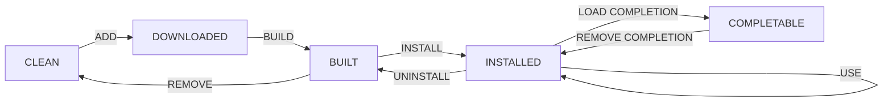

# Macbook Development Handbook

- [Macbook Development Handbook](#macbook-development-handbook)
- [Quickstart](#quickstart)
- [`$HOME`](#home)
- [Environment Variables](#environment-variables)
- [Brew](#brew)
  - [Commands](#commands)
- [Git](#git)
  - [Cheatsheet](#cheatsheet)
  - [Git based package management](#git-based-package-management)
- [ITerm2](#iterm2)
- [zsh](#zsh)
  - [Configuration files](#configuration-files)
  - [Aliases](#aliases)
  - [Basics](#basics)
  - [Stream manipulation](#stream-manipulation)
  - [Filesystem](#filesystem)
  - [Networking](#networking)
  - [Cryptography](#cryptography)
  - [Remote access](#remote-access)
  - [Permissions](#permissions)
  - [Disk](#disk)
  - [Process](#process)
  - [OS](#os)
  - [Terminal](#terminal)
  - [Compression](#compression)
  - [`ripgrep`](#ripgrep)
  - [`bat`](#bat)
  - [`fd`](#fd)
  - [`fzf`](#fzf)
  - [`jq`](#jq)
  - [`exa`](#exa)
  - [`glances`](#glances)
  - [Plugins](#plugins)
  - [Aesthetics](#aesthetics)
- [tmux](#tmux)
  - [Sessions](#sessions)
  - [Windows](#windows)
  - [tmuxinator](#tmuxinator)
  - [tmux-thumbs](#tmux-thumbs)
  - [tmux-better-mouse-mode](#tmux-better-mouse-mode)
  - [Cheatsheet](#cheatsheet-1)
- [neovim](#neovim)
  - [Installation](#installation)
  - [Configuration](#configuration)
  - [LSP](#lsp)
  - [Treesitter](#treesitter)
  - [Surround](#surround)
  - [Nerd-tree](#nerd-tree)
  - [Telescope](#telescope)
- [VSCode](#vscode)
- [Xcode](#xcode)
- [Emacs](#emacs)
- [Tools, LSPs, Configurations, etc.](#tools-lsps-configurations-etc)
  - [C / C++ / CMake / Conan](#c--c--cmake--conan)
  - [Java / Maven](#java--maven)
  - [Python / pip](#python--pip)
  - [Scala / sbt](#scala--sbt)
  - [JavaScript / node / npm](#javascript--node--npm)
  - [Rust / cargo](#rust--cargo)
  - [golang](#golang)
  - [Haskell / cabal](#haskell--cabal)
  - [Perl](#perl)
  - [Ruby / gem](#ruby--gem)
  - [PHP](#php)
  - [C#](#c)
  - [Dart / Flutter](#dart--flutter)
  - [Swift / Xcode](#swift--xcode)
  - [Kotlin / Gradle](#kotlin--gradle)
  - [Agda](#agda)
  - [Julia](#julia)
  - [Idris](#idris)
  - [R](#r)
  - [sh / zsh](#sh--zsh)
  - [Lua](#lua)
  - [json](#json)
  - [yaml](#yaml)
  - [toml](#toml)
  - [xml](#xml)
  - [ini](#ini)
  - [html](#html)
  - [css](#css)
  - [markdown](#markdown)
  - [latex](#latex)
  - [Solidity](#solidity)
  - [Cadence](#cadence)
  - [Move](#move)
  - [protobuf](#protobuf)
  - [kubectl](#kubectl)
  - [minikube](#minikube)
  - [Terraform](#terraform)
  - [Helm](#helm)
  - [AWS](#aws)
  - [GCP](#gcp)
  - [Azure](#azure)
  - [VirtualBox](#virtualbox)
  - [Docker](#docker)
  - [NordVPN](#nordvpn)
  - [Chrome](#chrome)
  - [Discord](#discord)
  - [Slack](#slack)
  - [Spotify](#spotify)
  - [Zoom](#zoom)
  - [Google Drive](#google-drive)
  - [OneDrive](#onedrive)
  - [iCloud](#icloud)
- [Devices](#devices)

# Quickstart

```sh
# Install base libraries from brew
brew install \
  git \
  exa \
  glances \
  btop \
  fzf \
  jq \
  tree \
  ripgrep \
  bat \
  fd \
  bash-completion \
  jesseduffield/lazygit/lazygit

# Other misc tools
gem install tmuxinator

# Initialize git
EMAIL="ssingal05@gmail.com"
ssh-keygen -t ed25519 -C "$EMAIL"
eval "$(ssh-agent -s)"
ssh-add ~/.ssh/id_ed25519
pbcopy < ~/.ssh/id_ed25519.pub

# ssh public key is now in clipboard.
# Add it to GitHub: https://www.github.com/settings/keys

# Clone all environment files
cd ~
git clone --recurse-submodules git@github.com:siddthesquid/env.git
export ENV_HOME=~/env

# Run bootstrapping code (as needed)
. ~/env/bootstrap/source_env_in_host_configs.zsh
. ~/env/bootstrap/symlink_configs_from_host_to_env.zsh
. ~/env/bootstrap/symlink_configs_from_env_to_host.zsh
. ~/env/bootstrap/update_xdg_dirs.zsh

# Install applications. (Some things in here may be manual)
pkg_add tmux
pkg_add neovim
pkg_add glances
pkg_add btop
pkg_add nordvpn
pkg_add google-chrome
pkg_add discord
pkg_add slack
pkg_add spotify
pkg_add zoom
```

# `$HOME`

For reference, this is what we expect the `$HOME` directory to look like:

```
.
├── .zshrc (sources ~/env/configs/zsh/zshrc)
├── .zshenv (sources ~/env/configs/zsh/zshenv)
├── .gitconfig -> ~/env/configs/git/.gitconfig
├── .gitignore -> ~/env/configs/git/.gitignore
├── .tmux.conf -> ~/env/configs/tmux/.tmux.conf
├── .tmuxinator -> ~/env/configs/tmux/.tmuxinator
├── .tmux
│   ├── external -> ~/env/configs/tmux/external
│   └── settings -> ~/env/configs/tmux/settings
├── .vimrc -> ~/env/configs/neovim/.vimrc
├── .config
│   └── nvim -> ~/env/configs/neovim/nvim
│       ├── lua
│       │   ├── adapters
│       │   ├── core
│       │   ├── external
│       │   ├── modules
│       │   ├── themes
│       │   └── siddthesquid
│       └── init.lua
├── .ripgreprc -> ~/env/configs/ripgrep/.ripgreprc
:
├── .aws
│   ├── config
│   └── credentials
├── .npmrc
├── .pypirc
├── .condarc
├── .m2
│   └── settings.xml
:
├── env
├── knowledge
├── vms
├── services
├── oss
├── opt
│   ├── lib
│   ├── bin
│   ├── include
│   ├── share
│   ├── etc
│   ├── var
│   ├── tmp
│   └── site-functions
:
├── sandbox
│   ├── <project-1>
│   ├── <project-2>
│   :
├── workspace
│   ├── <organization-1>
│   │   ├── <repo-1a>
│   │   ├── <repo-1b>
│   │   :
│   ├── <organization-2>
│   │   ├── <repo-2a>
│   │   :
│   :
:
├── documents
├── downloads
:
├── drive
├── public
├── shared
:
```

# Environment Variables

First, we have some global environment variables set and managed by `zsh` itself.

```sh
LANG=en_US.UTF-8
PWD=/Users/sidd
SHELL=/bin/zsh
TERM=xterm-256color
HOME=/Users/sidd
USER=sidd
OLDPWD=/Users/sidd
PATH=...
```

In general, any variables that start with `STS_` are specific to this devx setup. (`STS` stands for `siddthesquid`).

There are a few global variables that are exported by this repo. They can be overriden in `~/.zshenv`.

```sh
export STS_ENV_HOME="${STS_ENV_HOME:-$HOME/env}"
export STS_KNOWLEDGE_HOME="${STS_KNOWLEDGE_HOME:-$HOME/knowledge}"
export STS_VMS_HOME="${STS_VMS_HOME:-$HOME/vms}"
export STS_SERVICES_HOME="${STS_SERVICES_HOME:-$HOME/services}"
export STS_OSS_HOME="${STS_OSS_HOME:-$HOME/oss}"
export STS_OPT_HOME="${STS_OPT_HOME:-$HOME/opt}"
export STS_SANDBOX_HOME="${STS_SANDBOX_HOME:-$HOME/sandbox}"
export STS_WORKSPACE_HOME="${STS_WORKSPACE_HOME:-$HOME/workspace}"
```

Below is some copypasta for paths within this repo for scripts to use.

```sh
# Base
STS_ENV_BOOTSTRAP="$STS_ENV_HOME/bootstrap"
STS_ENV_CONFIGS="$STS_ENV_HOME/configs"
STS_ENV_LIBRARIES="$STS_ENV_HOME/libraries"
STS_ENV_PACKAGES="$STS_ENV_HOME/packages"
STS_ENV_SCRIPTS="$STS_ENV_HOME/scripts"

# Config
STS_ENV_CONFIGS_GIT="$STS_ENV_CONFIGS/git"
STS_ENV_CONFIGS_NEOVIM="$STS_ENV_CONFIGS/neovim"
STS_ENV_CONFIGS_RIPGREP="$STS_ENV_CONFIGS/ripgrep"
STS_ENV_CONFIGS_TMUX="$STS_ENV_CONFIGS/tmux"
STS_ENV_CONFIGS_ZSH="$STS_ENV_CONFIGS/zsh"

# Zsh specific
STS_ENV_ZSH_APPLICATIONS="$STS_ENV_CONFIGS_ZSH/applications"
STS_ENV_ZSH_GENERAL="$STS_ENV_CONFIGS_ZSH/general"
STS_ENV_ZSH_EXTERNAL="$STS_ENV_CONFIGS_ZSH/external"
STS_ENV_ZSH_PLUGINS="$STS_ENV_CONFIGS_ZSH/plugins"
STS_ENV_ZSH_MODULES="$STS_ENV_CONFIGS_ZSH/modules"
```

And then we have some variables that are specific to tmux sessions. We can use them in scripts that assume they are running in a tmux session. The values below are examples.

```sh
# Managed by tmux
TMUX=/private/tmp/tmux-501/default,19725,
TMUX_PANE=%19

# Custom - these should not change
STS_SESSION_WORKSPACE="~/workspace/some-org/some-repo"
STS_SESSION_TYPE="ts-pnpm-monorepo"
```

# Brew

We will rely on Brew to install most packages. Packages are installed in `/usr/local/Cellar` and symlinked to `/usr/local/bin`. We will also use Brew to manage services.

## Commands

| Command                           | Description                                |
| --------------------------------- | ------------------------------------------ |
| `brew install <package>`          | Install `<package>`                        |
| `brew uninstall <package>`        | Uninstall `<package>`                      |
| `brew upgrade <package>`          | Upgrade `<package>`                        |
| `brew install --cask <package>`   | Install `<package>` as a cask              |
| `brew uninstall --cask <package>` | Uninstall `<package>` as a cask            |
| `brew upgrade --cask <package>`   | Upgrade `<package>` as a cask              |
| `brew list`                       | List installed packages                    |
| `brew list --versions`            | List installed packages and their versions |
| `brew search <package>`           | Search for `<package>`                     |
| `brew info <package>`             | Get info about `<package>`                 |
| `brew update`                     | Update brew itself                         |
| `brew upgrade`                    | Upgrade all packages                       |
| `brew outdated`                   | List outdated packages                     |
| `brew cleanup`                    | Remove old versions of packages            |
| `brew doctor`                     | Diagnose brew issues                       |
| `brew services list`              | List services managed by brew              |

# Git

We've already installed `git` in quickstart. Let's look at how it's been customized for productivity.

## Cheatsheet

`~/.gitconfig -> ~/env/configs/git/.gitconfig` has a number of aliases and configurations. Below is a quick cheatsheet.

| Alias  | Description                          |
| ------ | ------------------------------------ |
| `stat` | Status, short, branch, untracked     |
| `logg` | Log with graph and pretty formatting |
| `last` | Last commit with stats               |
| `com`  | Commit with message                  |
| `rem`  | List remote repositories             |
| `dif`  | Vimdiff tool                         |
| `conf` | List global configurations           |
| `find` | Find text in all commits             |
| `main` | Checkout main branch                 |
| `chk`  | Checkout branch                      |
| `new`  | Create new branch                    |

## Git based package management

We want a consistent and repeatable workflow when installing stuff from git. Packages will roughly have the following overall lifecycle, where possible:



- We need a way of checking what state we are in
- Version numbers are required
- Calling a function should invoke all previous functions, if not invoked

| Command                         | Description                                                  |
| ------------------------------- | ------------------------------------------------------------ |
| `gpkg add PACKAGE [VERSION]`    | download, build, and set as default `<package>[-<version>]`  |
| `gpkg remove PACKAGE [VERSION]` | remove files for `<package>[-<version>]`                     |
| `gpkg load <package>`           | download and build `<package>[-<version>]`, but don't use it |
| `gpkg versions <package>`       | list all versions of `<package>`                             |
| `gpkg latest <package>`         | get the latest version of `<package>`                        |

The process roughly looks as follows:

1. Clone the repo
2. Checkout a particular version or branch
3. Build
4. Copy artifacts to `$INSTALL_DIR/<project>-<version>`
5. Symlink `$INSTALL_DIR/<project>` to `$INSTALL_DIR/<project>-<version>`

# ITerm2

# zsh

`zsh` is a shell interpreter, meaning it parses commands sent to it from the terminal/terminal emulator and executes them. Our options for a shell interpreter generally include `sh`, `ksh`, `bash`, `zsh`, and `fish`. `zsh` is feature rich and, because it is the default shell on macOS, convenient to use.

If `zsh` is launched in interactive mode, that means the user is typing the commands into the shell. Otherwise, a file must be provided. We can check if `zsh` is running interactively with

```sh
[[ -o interactive ]]
```

`zsh` can also be launched in login mode. All that practically means is that it will source `~/.zprofile` instead of `~/.zshrc`. We can check if `zsh` is running in login mode with

```sh
[[ -o login ]]
```

## Configuration files

When `zsh` is launched, it will source the following files in the following order:

| Configuration File | Context         |
| ------------------ | --------------- |
| `/etc/zshenv`      | Always          |
| `~/.zshenv`        | Always          |
| `/etc/zprofile`    | Login           |
| `~/.zprofile`      | Login           |
| `/etc/zshrc`       | Interactive     |
| `~/.zshrc`         | Interactive     |
| `/etc/zlogin`      | Login           |
| `~/.zlogin`        | Login           |
| `/etc/zlogout`     | Login (on exit) |
| `~/.zlogout`       | Login (on exit) |

Generally, we only need to use

- `~/.zshenv` for configuring `PATH`, `*_HOME`, and `fpath` variables
- `~/.zshrc` for normal shell usage

## Aliases

## Basics

## Stream manipulation

## Filesystem

## Networking

## Cryptography

## Remote access

## Permissions

## Disk

## Process

## OS

## Terminal

## Compression

## `ripgrep`

`ripgrep` replaces `grep`. It's faster to use, and respects `.gitignore` files by default. The configuration file is `~/.ripgreprc -> ~/env/configs/ripgrep/.ripgreprc` (as set by `RIPGREP_CONFIG_PATH`) and contains some basic settings.

| Command                                      | Description                                                                   |
| -------------------------------------------- | ----------------------------------------------------------------------------- |
| `rg <pattern>`                               | Search for a pattern in the current directory                                 |
| `rg <pattern> <path>`                        | Search in a specific file or directory                                        |
| `rg -i <pattern>`                            | Search with case-insensitive match                                            |
| `rg -w <pattern>`                            | Search for exact word matches                                                 |
| `rg '<regex_pattern>'`                       | Search using regular expressions                                              |
| `rg -l <pattern>`                            | List files that contain the pattern                                           |
| `rg -L <pattern>`                            | List files that do NOT contain the pattern                                    |
| `rg --type <file_type> <pattern>`            | Search only in certain file types                                             |
| `rg --type-list`                             | List all supported file types                                                 |
| `rg -C N <pattern>`                          | Show N lines before and after the match                                       |
| `rg -B N <pattern>`                          | Show N lines before the match                                                 |
| `rg -A N <pattern>`                          | Show N lines after the match                                                  |
| `rg -o <pattern>`                            | Only show the matched part of the line                                        |
| `rg -e <pattern1> -e <pattern2>`             | Search for multiple patterns                                                  |
| `rg -n <pattern>`                            | Show line numbers with search results                                         |
| `rg --glob '!<file_or_directory>' <pattern>` | Exclude files/directories from search                                         |
| `rg --hidden`                                | Search hidden files and directories                                           |
| `rg -v <pattern>`                            | Invert matches (select non-matching lines)                                    |
| `rg -m N <pattern>`                          | Limit the search to the first N matches                                       |
| `rg --sort <sort_by>`                        | Sort results. `<sort_by>` can be 'path', 'modified', 'accessed', or 'created' |
| `rg --sortr <sort_by>`                       | Sort results in reverse order                                                 |

## `bat`

## `fd`

## `fzf`

## `jq`

## `exa`

## `glances`

## Plugins

- zsh-autosuggestions
- zsh-syntax-highlighting
- zsh-completions

## Aesthetics

# tmux

## Sessions

There are four types of sessions we care about:

- default
- project/workspace
- IDE integrated
- remote access

When loading the terminal, we automatically attach to the `default` session, or create it if it does not exist.

Certain folders will be marked as valid project/workspace directories. We can also choose any arbitrary directory to be a project/workspace directory through some provided command.

When we ssh into a remote machine, we automatically attach to the remote session, or create it if it does not exist.

## Windows

- Development
- Shell
- Testing
- Tasks
- Package Management
- Scratchpad
- Tools
- Files
- Git
- Monitor
- Process
- Knowledge
- Env

## tmuxinator

## tmux-thumbs

## tmux-better-mouse-mode

## Cheatsheet

# neovim

`nvim` is our text editor of choice. It runs on the terminal and is incredibly configurable.

In our `nvim` setup, we attach a single `nvim` instance to facilitate all textual editing for any given "project". The below step-by-step gives a rough idea of how this works:

1. Open `nvim` on either a single file or directory
2. Determine the root directory of the project
3. Determine the type of workspace based on files and their contents
4. Load all configurations associated with the workspace type

So for example, `nvim` might find a `package.json` in the root directory and understand that it's a PNPM monorepo root. It will then load all configurations associated with PNPM monorepo workspaces. Configurations include things like keybindings, LSPs, linters, formatters, etc.

Each `tmux` session ideally represents a single project or workspace, and every project is associated with a root directory. This means that whenever we open a `tmux` session, we can automatically open `nvim` in the root directory of the project.

## Installation

## Configuration

## LSP

## Treesitter

## Surround

## Nerd-tree

## Telescope

# VSCode

# Xcode

# Emacs

# Tools, LSPs, Configurations, etc.

## C / C++ / CMake / Conan

## Java / Maven

## Python / pip

## Scala / sbt

## JavaScript / node / npm

## Rust / cargo

## golang

## Haskell / cabal

## Perl

## Ruby / gem

## PHP

## C#

## Dart / Flutter

## Swift / Xcode

## Kotlin / Gradle

## Agda

## Julia

## Idris

## R

## sh / zsh

## Lua

## json

## yaml

## toml

## xml

## ini

## html

## css

## markdown

## latex

## Solidity

## Cadence

## Move

## protobuf

## kubectl

## minikube

## Terraform

## Helm

## AWS

## GCP

## Azure

## VirtualBox

## Docker

## NordVPN

## Chrome

## Discord

## Slack

## Spotify

## Zoom

## Google Drive

## OneDrive

## iCloud

# Devices

- Mouse
- Keyboard
- Monitors
- Webcam/Camera
- WiFi
- Bluetooth
- Audio Out
  - Wireless Headphones
  - Wired Headphones
  - Speakers
- Audio In
  - Microphone
- Network
