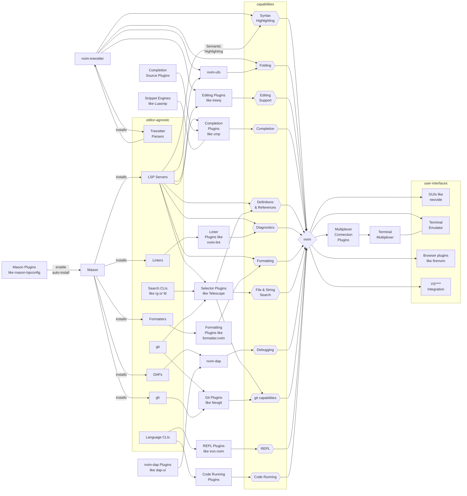

# Core Concepts for Developer Tools

A common theme among a lot of the developer tools we will be using is the ability to easily **program** in new features, rather than only relying on 3rd party plugins and configurations.

Thus, we need to understand the tools from the ground up. Doing this will allow us to

- create automation for any workflow
- understand potential security risks

# zsh

## `fzf`

# Tmux

## tmux Options Cheatsheet

### Built-in Options

These are commonly used built-in tmux options.

#### Global Options

| Option Name         | Description |
|---------------------|-------------|
| `status`            | Enables or disables the status bar. |
| `status-interval`   | Time in seconds for refreshing the status line. |
| `status-keys`       | Key bindings mode for the status line (e.g., `emacs`, `vi`). |
| `mouse`             | Enables mouse support for selecting panes, resizing, etc. |
| `default-shell`     | Default shell for new windows and panes. |
| `default-command`   | Command to run when creating a new pane or window. |
| `escape-time`       | Time in ms to wait after escape key (useful for vi mode). |
| `base-index`        | Start window numbering from 0 or 1. |
| `renumber-windows`  | Automatically renumber windows when one is closed. |

#### Session Options

| Option Name        | Description |
|--------------------|-------------|
| `status`           | Enables the status bar for this session. |
| `detach-on-destroy`| Whether the client detaches when session is destroyed. |
| `display-panes-time` | Time in ms to display pane numbers. |

#### Window Options

| Option Name                | Description |
|----------------------------|-------------|
| `automatic-rename`         | Automatically rename windows based on running process. |
| `window-status-format`     | Format for inactive windows in the status bar. |
| `window-status-current-format` | Format for the active window in the status bar. |
| `synchronize-panes`        | Send input to all panes in the window. |
| `remain-on-exit`           | Keep panes open after their command exits. |

---

### User Options Reference

tmux supports user-defined options using the `@` prefix.

| Scope      | Set Command | Get Command | Can Be Used In |
|------------|-------------|-------------|----------------|
| Global     | `tmux set-option -g @key value` | `tmux show-option -g -v @key` | Status line, scripts |
| Session    | `tmux set-option -t session_name @key value` | `tmux show-option -v -t session_name @key` | Status line, scripts |
| Window     | `tmux set-window-option -t session:window @key value` | `tmux show-window-option -v -t session:window @key` | Window status format, scripts |

# Neovim

## Buffers

| Role               | `buftype`        | Editable | UI-Oriented | Interactive | File-Based |
|--------------------|------------------|----------|-------------|-------------|------------|
| File Editing       | `""`             | Yes      | No          | Yes         | Yes        |
| Tool Interface     | `"nofile"`       | No       | Yes         | Yes         | No         |
| Terminal           | `"terminal"`     | No       | Yes         | Yes         | No         |
| Prompt             | `"prompt"`       | Yes      | Yes         | Yes         | No         |
| Help / Documentation | `"help"`      | No       | Yes         | No          | No         |
| Notifications      | `"nofile"`       | No       | Yes         | No          | No         |
| Hidden / Scratch   | `"acwrite"`, etc.| Maybe    | No          | Maybe       | No         |


## Namespaces

## Extmarks

### Virtual Text

## Highlight Groups

## Sign Columns

## Navigation

## Visual Selection

## Modifying text

## Undos

## Folding

## Display

## Quickfix

## Clipboard

## Macros

## Tree

## Telescope

## `vim.diagnostic`

Diagnostics allow neovim subsystems to annotate ranges of cells in buffers with a `vim.Diagnostic`. We can think of it as the database that 

- a custom message
- severity level (error, warn, info, hint)
- diagnostic code
- custom user data

They can present themselves in many ways to the user

- signs
- underlines/highlights
- virtual text
- floating windows
- location list
- quickfix list
- telescope
- trouble.nvim
- status line

Generally, diagnostics are controlled by

- LSPs
- linters
- manual?
- AI?
- Tests

### Overview

### Interface

As per `:h diagnostic-structure`, `vim.Diagnostic` has the following schema:

```
    Fields: ~
      - {bufnr}?      (`integer`) Buffer number
      - {lnum}        (`integer`) The starting line of the diagnostic
                      (0-indexed)
      - {end_lnum}?   (`integer`) The final line of the diagnostic (0-indexed)
      - {col}         (`integer`) The starting column of the diagnostic
                      (0-indexed)
      - {end_col}?    (`integer`) The final column of the diagnostic
                      (0-indexed)
      - {severity}?   (`vim.diagnostic.Severity`) The severity of the
                      diagnostic |vim.diagnostic.severity|
      - {message}     (`string`) The diagnostic text
      - {source}?     (`string`) The source of the diagnostic
      - {code}?       (`string|integer`) The diagnostic code
      - {user_data}?  (`any`) arbitrary data plugins can add
      - {namespace}?  (`integer`)
```

Severities

```
    vim.diagnostic.severity.ERROR
    vim.diagnostic.severity.WARN
    vim.diagnostic.severity.INFO
    vim.diagnostic.severity.HINT
```

## nvim-cmp

## Tree-sitter

## LSP

## Testing

## Linting

## DAP

## Snippets

## AI

## Ecosystem



# Treesitter

[Treesitter](https://tree-sitter.github.io/tree-sitter) is a parser generator tool and an incremental parsing library. For languages for which tree-sitter parsers exist, we can view and modify code in a language agnostic way. This also includes things like

- syntax highlighting (even embedded in markdown files),
- quicker/smarter navigation (eg jump to the next function)
- target syntactic elements and blocks for commands

Parsers are usually written in javascript but then compiled to optimized C. It is built into neovim and many plugins even assume the usage of treesitter, so understanding tree-sitter is crucial.

## Core Concepts

Let's quickly take a look at Tree-sitter from the perspective of a programming language developer.

Clients of a Tree-sitter grammar can use the grammar on a single file to generate a syntax tree. These clients can include

- programs using Tree-sitter libraries to parse and modify a file
- IDEs (eg neovim)
- text readers (eg bat)

Tree-sitter has four main entities:

- `TSLanguage` - the language-specific compiled C definitions that tell tree-sitter how a specific language is to be parsed
- `TSParser` - can parse a `TSLanguage` to create a `TSTree`
- `TSTree` - syntax tree of a file, composed of `TSNode`s
- `TSNode` - a node of the syntax tree. can contain metadata

This is what would happen:

- The developer would generate a `TSLanguage` by writing the grammar (i.e. in JS) and then compiling with Tree-sitter
- Clients can use Tree-sitter APIs to navigate and 

## Queries

## Syntax Highlighting

## Code Navigation

# LSP

LSPs give us

- diagnostic
- omnifunc
- tag func
- format expression

# DAP

# Testing / Coverage

# git

# fzf

